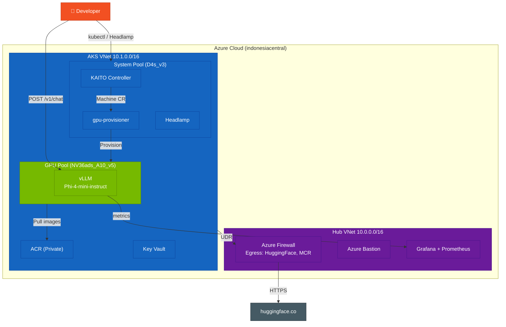
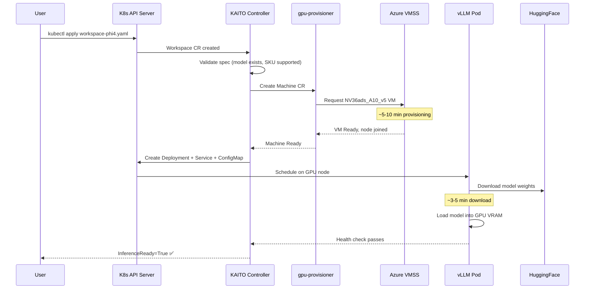
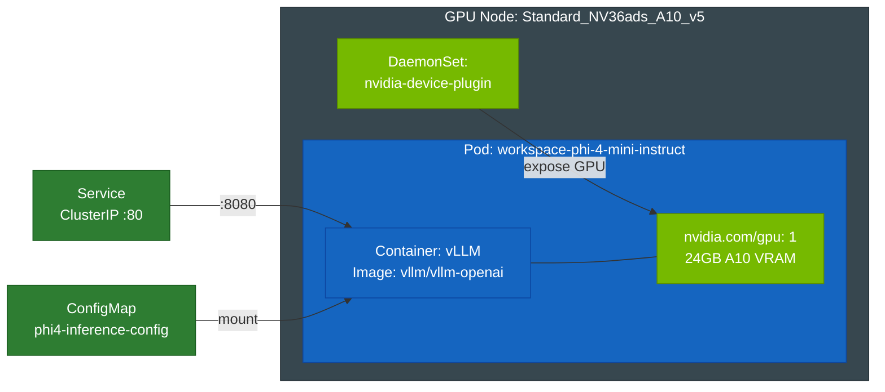
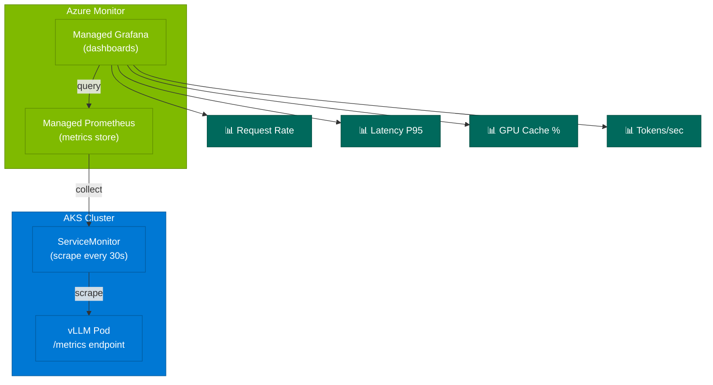
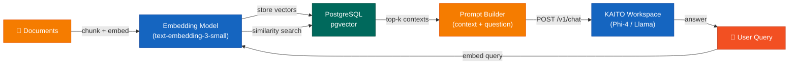

# Architecture Diagrams
{: .no_toc }

Visual overview of KAITO on AKS — from high-level topology to pod-level details.
{: .fs-6 .fw-300 }

---

## Network Topology

---

## KAITO Deployment Flow

---

## Workspace Pod Architecture

---

## Monitoring Stack

---

## RAG Pipeline (Advanced)

---

## KAITO vs Traditional (Timeline)

```mermaid
gantt
    title Deployment Timeline Comparison
    dateFormat X
    axisFormat %M min

    section Without KAITO
    Create GPU Node Pool     :a1, 0, 5
    Install NVIDIA Drivers   :a2, after a1, 2
    Create PVC + Download    :a3, after a2, 15
    Deploy vLLM              :a4, after a3, 5
    Configure Service        :a5, after a4, 2
    Health Check Setup       :a6, after a5, 1

    section With KAITO
    kubectl apply workspace  :b1, 0, 1
    Auto GPU Provisioning    :b2, after b1, 8
    Auto Model + vLLM        :b3, after b2, 5
    Ready ✅                  :milestone, after b3, 0
```

