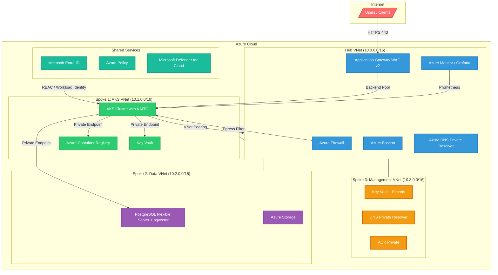
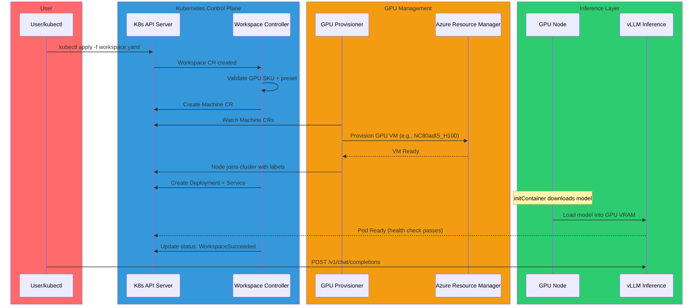
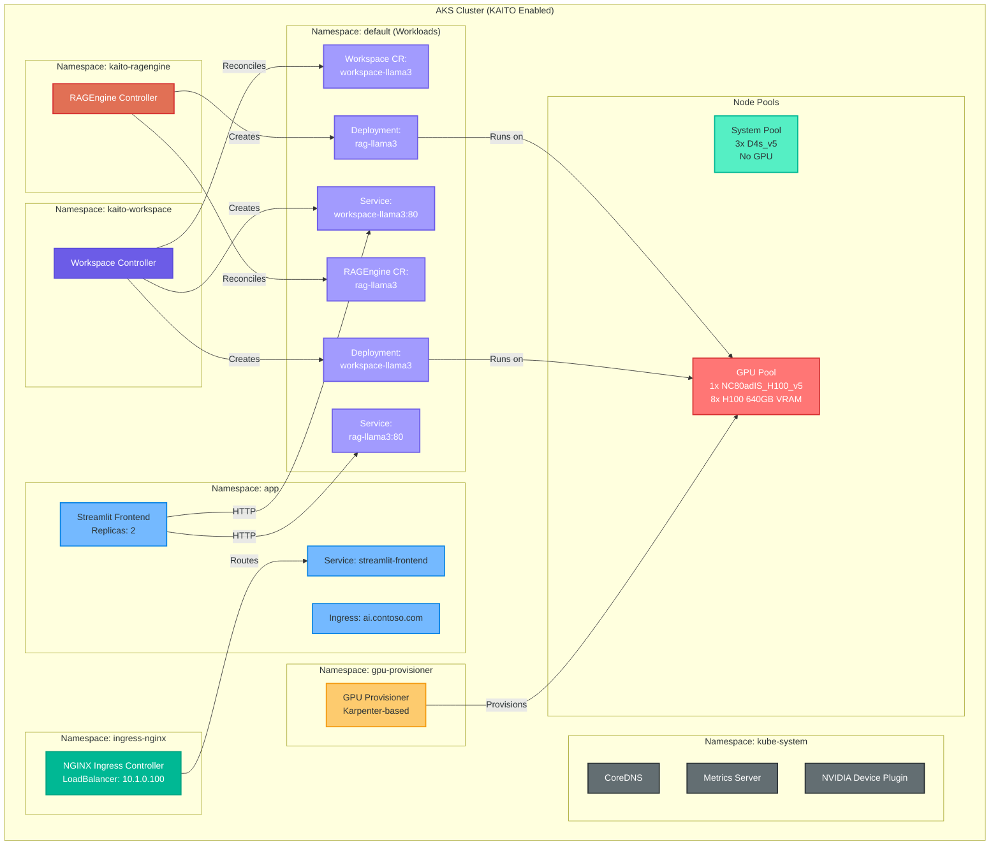
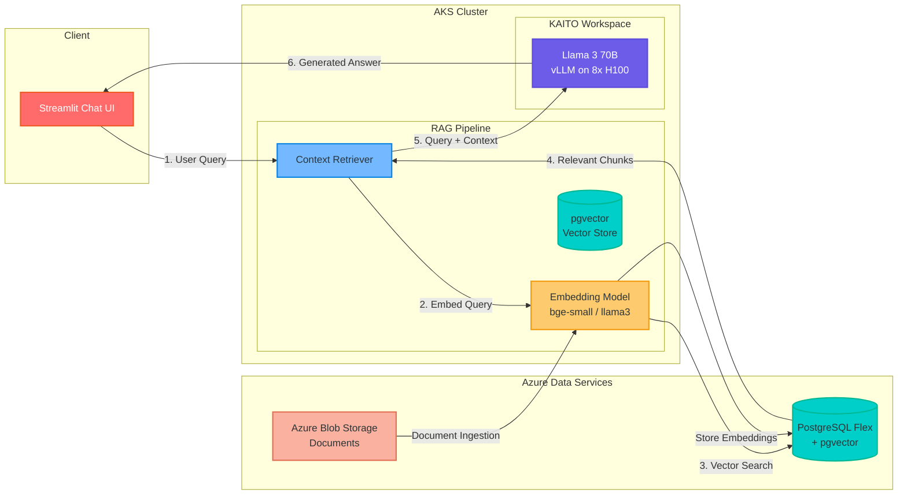
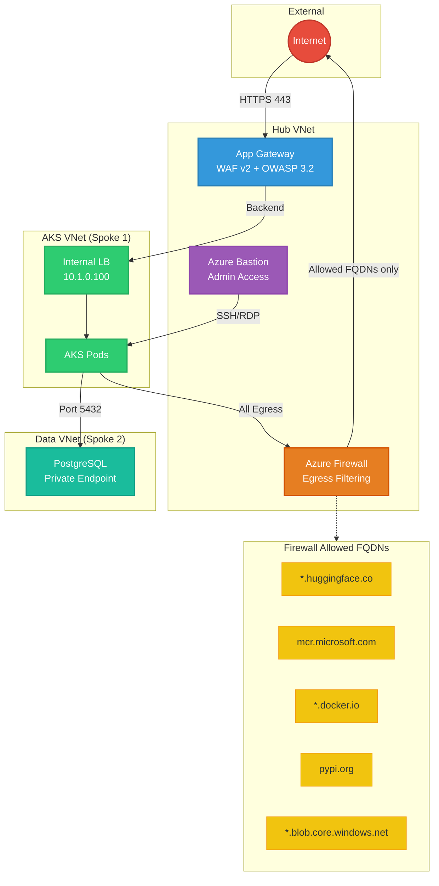
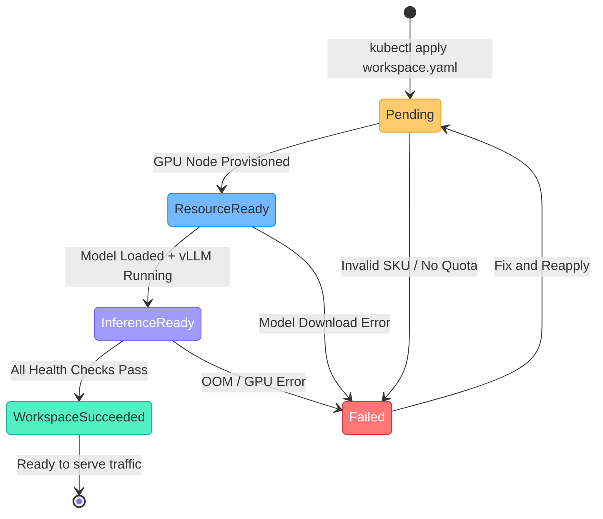
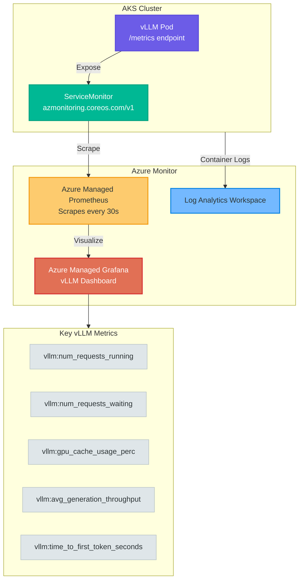
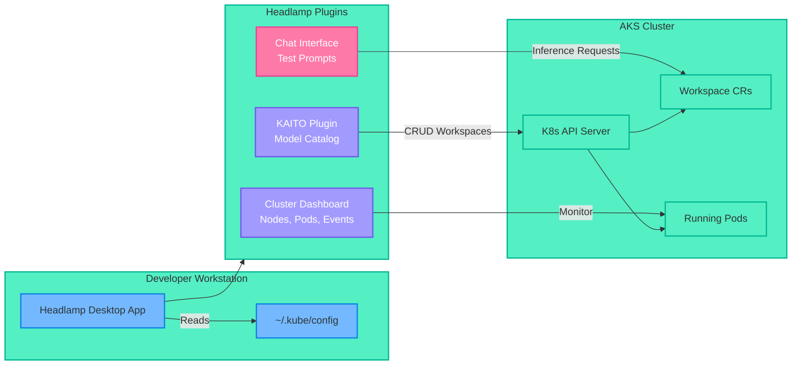

# KAITO on AKS - Architecture & Deployment Guide
{: .fs-9 }

Deploy AI Models with KAITO and Headlamp on Azure Kubernetes Service (AKS)
{: .fs-6 .fw-300 }

---

## Overview

**KAITO** (Kubernetes AI Toolchain Operator) simplifies AI/ML model deployment on AKS by automating GPU provisioning, model downloading, and inference server setup with a single YAML manifest.

### Key Components

| Component | Purpose |
|-----------|---------|
| **KAITO** | Kubernetes AI Toolchain Operator - automates AI/ML model deployment |
| **Headlamp** | Kubernetes GUI dashboard with KAITO plugin |
| **vLLM** | High-performance inference engine with continuous batching |
| **Azure Monitor** | Prometheus metrics and Grafana dashboards |

---

## High-Level Architecture



---

## KAITO Deployment Flow




---

## AKS Cluster - Kubernetes Resources



---

## KAITO Workspace Pod Architecture

```mermaid
graph LR
    subgraph GPU_Node["GPU Node: Standard_NC80adIS_H100_v5"]
        subgraph Pod["Pod: workspace-llama3"]
            Init[initContainer:<br/>model-weights-downloader<br/>Downloads from HuggingFace]
            vLLM[Container: vllm-inference<br/>Port: 5000<br/>GPU Memory: 85%]
            Vol[(Volume:<br/>/workspace/vllm/weights)]
        end
        
        subgraph GPUs["8x NVIDIA H100 80GB NVL"]
            GPU1[H100 no.1]
            GPU2[H100 no.2]
            GPU3[H100 no.3]
            GPU4[H100 no.4]
            GPU5[H100 no.5]
            GPU6[H100 no.6]
            GPU7[H100 no.7]
            GPU8[H100 no.8]
        end
    end

    subgraph Service["Service: workspace-llama3"]
        EP[ClusterIP:80 to Pod:5000]
    end

    Init -->|Downloads weights| Vol
    Vol -->|Mounted| vLLM
    vLLM -->|Tensor Parallel| GPUs
    EP -->|Traffic| vLLM

    subgraph Endpoints["OpenAI-Compatible API"]
        Chat[POST /v1/chat/completions]
        Comp[POST /v1/completions]
        Models[GET /v1/models]
        Health[GET /health]
        Prom[GET /metrics]
    end

    Service --> Endpoints

    classDef initC fill:#fdcb6e,stroke:#f39c12,color:#2d3436,stroke-width:2px
    classDef vllmC fill:#6c5ce7,stroke:#5b4cdb,color:#fff,stroke-width:2px
    classDef volume fill:#00cec9,stroke:#00b894,color:#2d3436,stroke-width:2px
    classDef gpuChip fill:#ff7675,stroke:#d63031,color:#fff,stroke-width:2px
    classDef svc fill:#74b9ff,stroke:#0984e3,color:#2d3436,stroke-width:2px
    classDef endpoint fill:#55efc4,stroke:#00b894,color:#2d3436,stroke-width:2px

    class Init initC
    class vLLM vllmC
    class Vol volume
    class GPU1,GPU2,GPU3,GPU4,GPU5,GPU6,GPU7,GPU8 gpuChip
    class EP svc
    class Chat,Comp,Models,Health,Prom endpoint
```




---

## Data Flow: RAG Pipeline



---

## Network Security Architecture



---

## Workspace Status Lifecycle



---

## Monitoring and Observability Stack



---

## KAITO vs Traditional Deployment

```mermaid
gantt
    title Deployment Time Comparison
    dateFormat X
    axisFormat %s min

    section Traditional
    Create GPU Node Pool     :a1, 0, 5
    Install NVIDIA Drivers   :a2, after a1, 2
    Download Model           :a3, after a2, 30
    Deploy vLLM Server       :a4, after a3, 5
    Configure Service        :a5, after a4, 2
    Health Checks Setup      :a6, after a5, 1

    section KAITO
    Apply Workspace YAML     :b1, 0, 1
    Auto GPU Provisioning    :b2, after b1, 5
    Auto Model Download      :b3, after b2, 7
    Auto Service Ready       :b4, after b3, 2
```




---

## Supported GPU SKUs

| SKU | GPU | Count | VRAM | Best For |
|-----|-----|-------|------|----------|
| Standard_NC4as_T4_v3 | T4 | 1 | 16 GB | Small models, dev/test |
| Standard_NV36ads_A10_v5 | A10 | 1 | 24 GB | **Recommended** - Phi-4, small Llama |
| Standard_NC24ads_A100_v4 | A100 | 1 | 80 GB | Medium models (13B-30B) |
| Standard_NC96ads_A100_v4 | A100 | 4 | 320 GB | Large models (70B) |
| Standard_NC80adis_H100_v5 | H100 | 2 | 188 GB | Large models, high throughput |
| Standard_ND96isr_H100_v5 | H100 | 8 | 640 GB | 70B+ models, multi-node |
| Standard_ND96isr_H200_v5 | H200 | 8 | 1128 GB | Largest models |

---

## Quick Start

```yaml
# workspace-phi4.yaml - Deploy Phi-4 in 15 lines!
apiVersion: kaito.sh/v1beta1
kind: Workspace
metadata:
  name: workspace-phi-4-mini-instruct
  namespace: default
resource:
  instanceType: "Standard_NV36ads_A10_v5"
  labelSelector:
    matchLabels:
      apps: phi-4-mini-instruct
inference:
  preset:
    name: phi-4-mini-instruct
```

```bash
# One command to deploy
kubectl apply -f workspace-phi4.yaml

# Check status
kubectl get workspace
```

---

## Headlamp Integration



---

<footer>
Built for the Azure and Kubernetes community
</footer>
