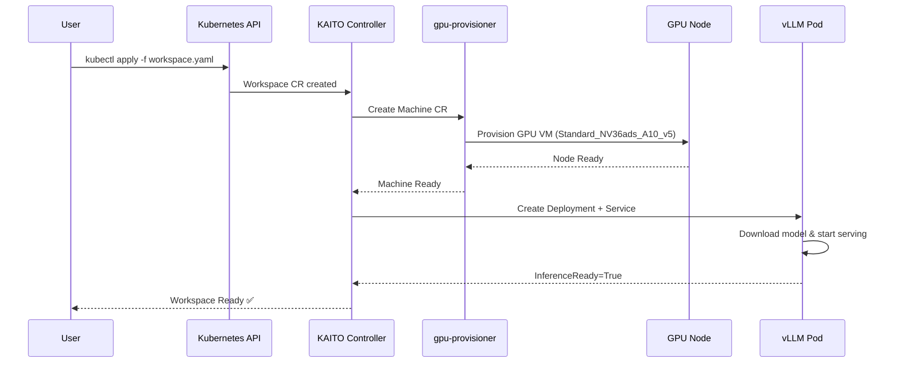

# What is KAITO?
{: .no_toc }

Kubernetes AI Toolchain Operator — deploy AI models with one YAML manifest.
{: .fs-6 .fw-300 }

  
Table of contents

  {: .text-delta }
- TOC
{:toc}

---

## 1.1 Introduction

**KAITO** (Kubernetes AI Toolchain Operator) is an open-source operator that simplifies deploying large language models (LLMs) on Azure Kubernetes Service (AKS). It automates:

- **GPU Node Provisioning** — automatically adds GPU nodes when you deploy a workspace
- **Model Downloading** — pulls model weights from HuggingFace or preset registries
- **Inference Server Setup** — configures vLLM with optimized parameters
- **Service Creation** — exposes the model via a ClusterIP service

> **Official Docs**: [KAITO AI Toolchain Operator for AKS](https://learn.microsoft.com/en-us/azure/aks/ai-toolchain-operator)

---

## 1.2 Key Benefits

| Benefit | Description |
|---------|-------------|
| **Simplified Deployment** | Deploy AI models with ~15 lines of YAML instead of 300+ |
| **Automatic GPU Provisioning** | Nodes provisioned on-demand, deprovisioned on delete |
| **Pre-configured Models** | Llama, Phi, Mistral, Falcon with optimized settings |
| **Auto-scaling** | Scales GPU nodes based on workload demand |
| **Cost Optimization** | Pay only for active inference workloads |
| **Kubernetes Native** | Uses CRDs, works with RBAC, namespaces, monitoring |
| **vLLM Integration** | High-performance inference with continuous batching |

---

## 1.3 Business Value

| Metric | Traditional | With KAITO |
|--------|------------|------------|
| ⏱️ Time to Production | Days | Hours |
| 🧑‍💻 ML Expertise Required | High | Low |
| 💰 Infrastructure Cost | High (idle GPUs) | Optimized (on-demand) |
| 🔧 Maintenance Overhead | High | Minimal |
| 📝 YAML Complexity | 300-500 lines | ~15 lines |

---

## 1.4 How KAITO Works

---

## 1.5 Supported Models

| Model | Parameters | GPU Required | Access |
|-------|-----------|-------------|--------|
| **Phi-4-mini-instruct** | 3.8B | 1x A10 (24GB) | Public |
| **Llama-3.1-8B-instruct** | 8B | 1x A10 (24GB) | Private (HF token) |
| **Llama-3.1-70B-instruct** | 70B | 4x A100 (320GB) | Private (HF token) |
| **Mistral-7B-instruct** | 7B | 1x A10 (24GB) | Public |
| **Falcon-40B-instruct** | 40B | 2x A100 (160GB) | Public |

{: .note }
> For the full model catalog, see [KAITO supported models](https://github.com/kaito-project/kaito/tree/main/presets).

---

## 1.6 KAITO vs Traditional — Step by Step

| Step | Without KAITO | With KAITO |
|------|---------------|------------|
| 1. GPU Node Pool | `az aks nodepool add` with GPU SKU, taints, labels | ✅ Automatic |
| 2. GPU Drivers | Install NVIDIA device plugin DaemonSet | ✅ Pre-configured |
| 3. Model Download | Init container + PVC + download script | ✅ Automatic |
| 4. Inference Server | Deploy vLLM manually with resource limits | ✅ Optimized preset |
| 5. Service/Ingress | Create Service, configure networking | ✅ Auto-created |
| 6. Health Checks | Configure liveness/readiness probes | ✅ Built-in |
| 7. Scaling | Set up HPA, configure GPU metrics | ✅ Node auto-provisioning |

---

[Next: Architecture →]({{ site.baseurl }}){: .btn .btn-primary }
