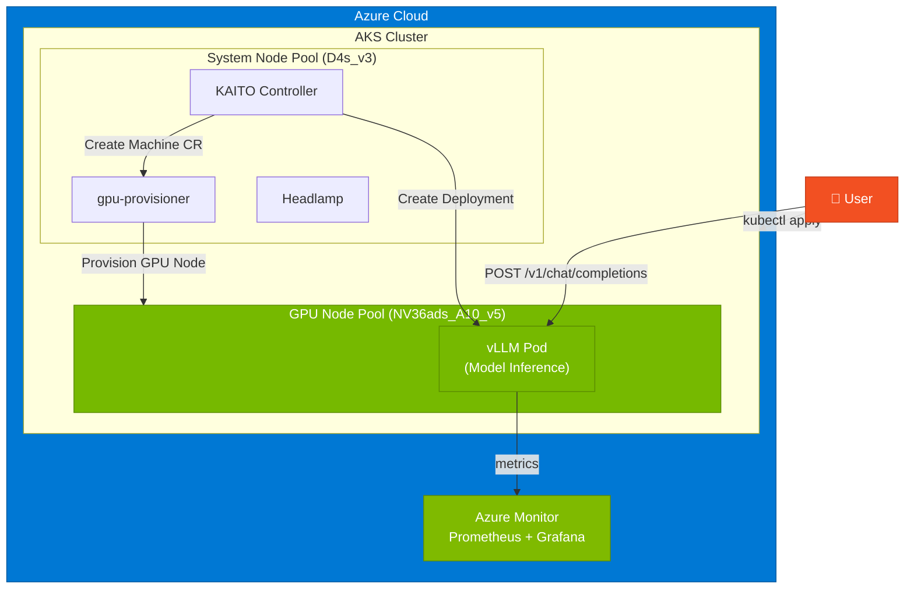
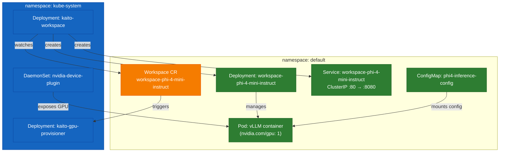
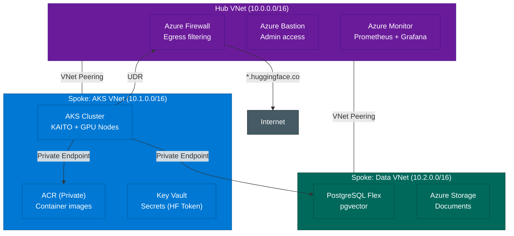
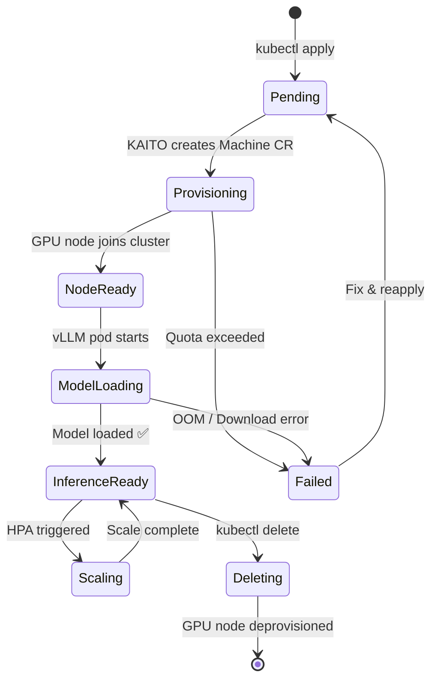
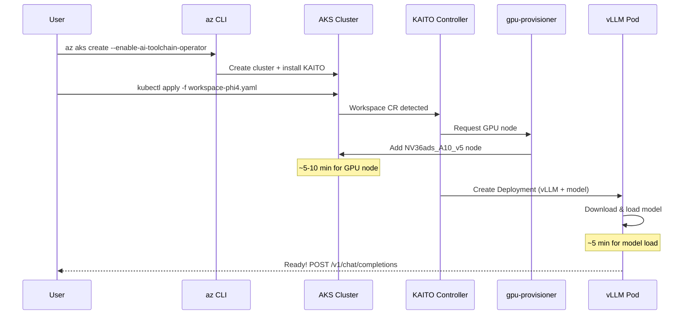

# Architecture
{: .no_toc }

System design and component interactions for KAITO on AKS.
{: .fs-6 .fw-300 }

  
Table of contents

  {: .text-delta }
- TOC
{:toc}

---

## 2.1 High-Level Architecture

---

## 2.2 Kubernetes Resource Map

---

## 2.3 Network Topology (Production)

---

## 2.4 KAITO Workspace Lifecycle

---

## 2.5 Deployment Flow

---

[← Overview]({{ site.baseurl }}){: .btn .mr-2 }
[Next: Prerequisites →]({{ site.baseurl }}){: .btn .btn-primary }
